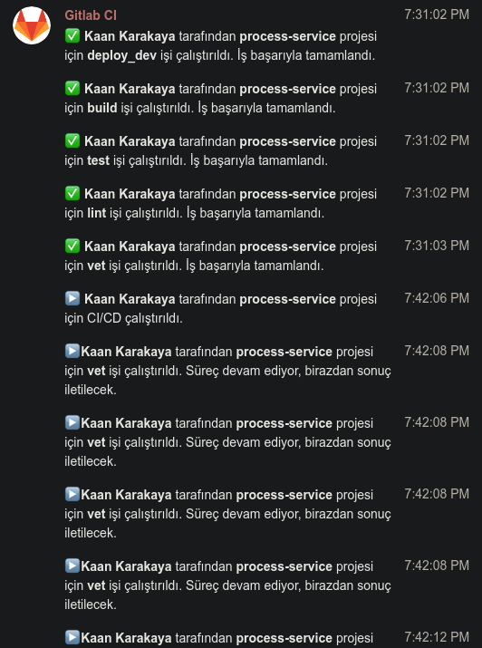
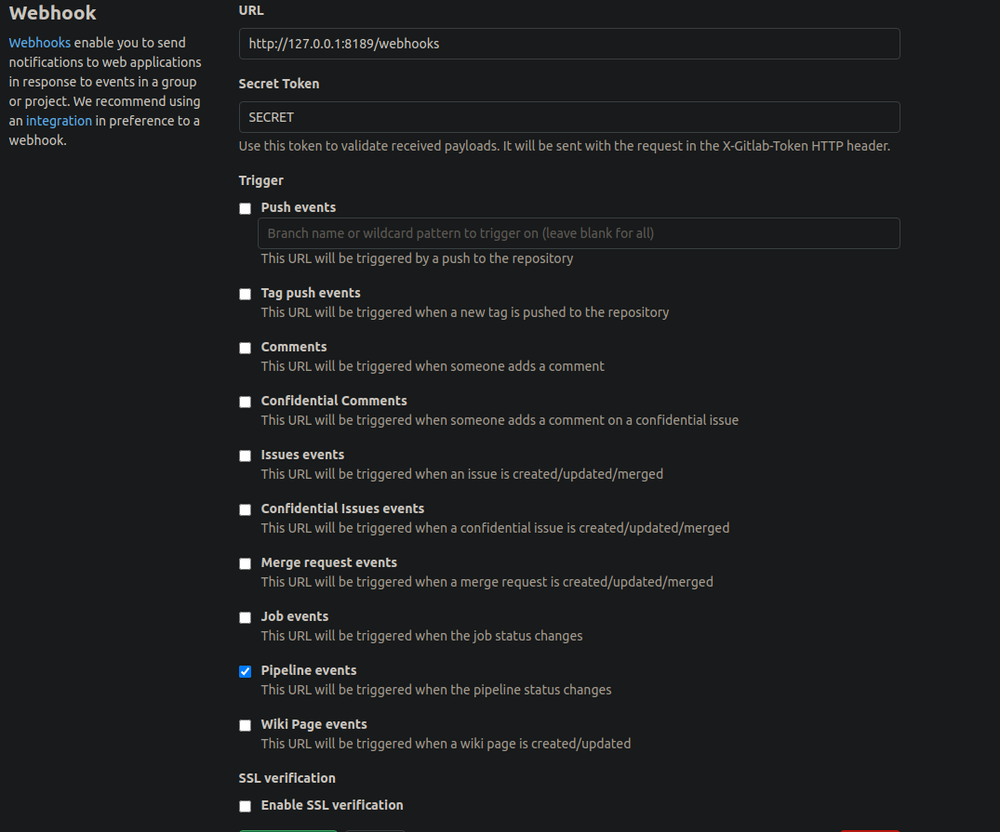

# Gitlab runner telagram bot

This bot send gitlab runner job status to telegram



## Building binary

Download depencies

```bash
go mod vendor #or
go get
```

## Configure

Copy `config_example.yml` to `config.yml` edit telegram token , webhook secret and chat id.

Add webhook to gitlab

